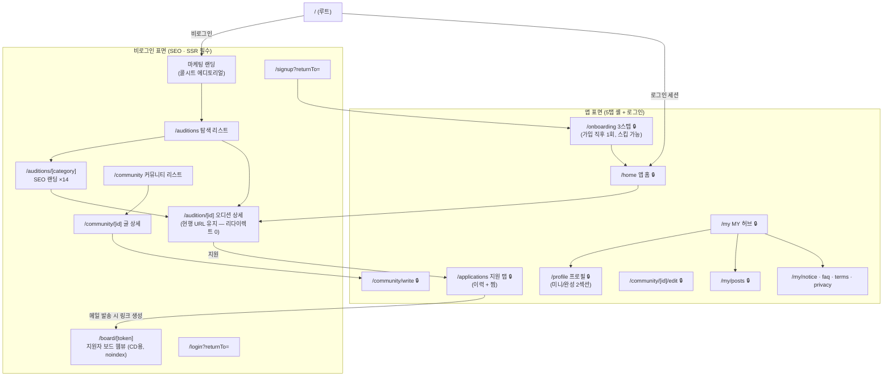
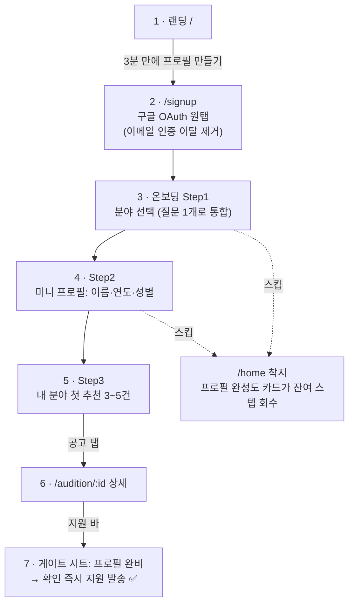
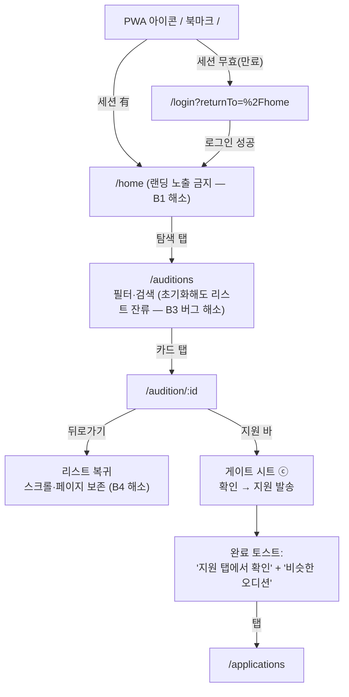
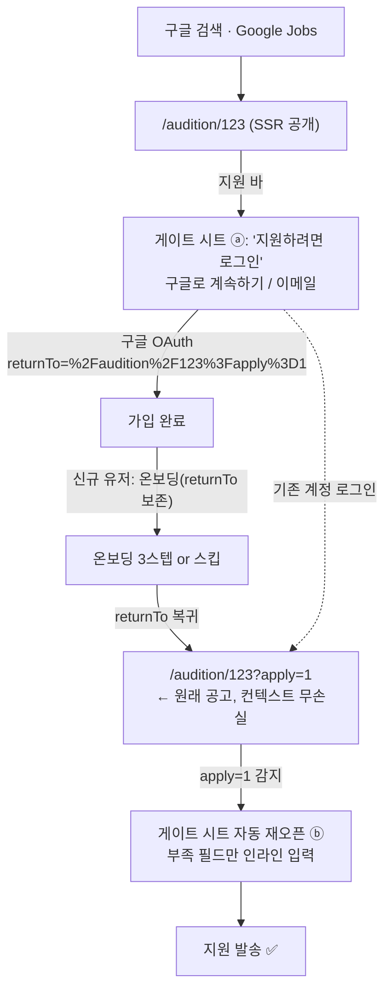
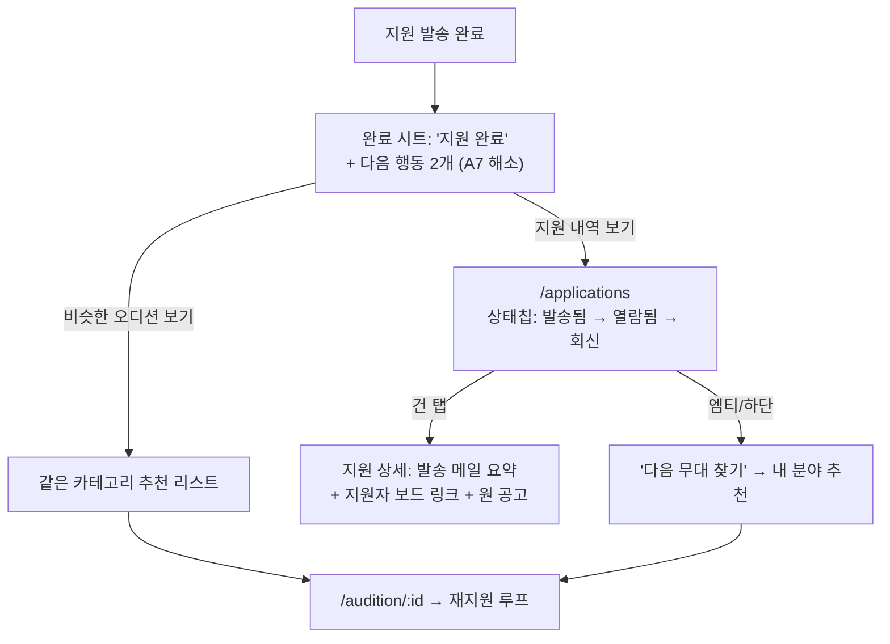
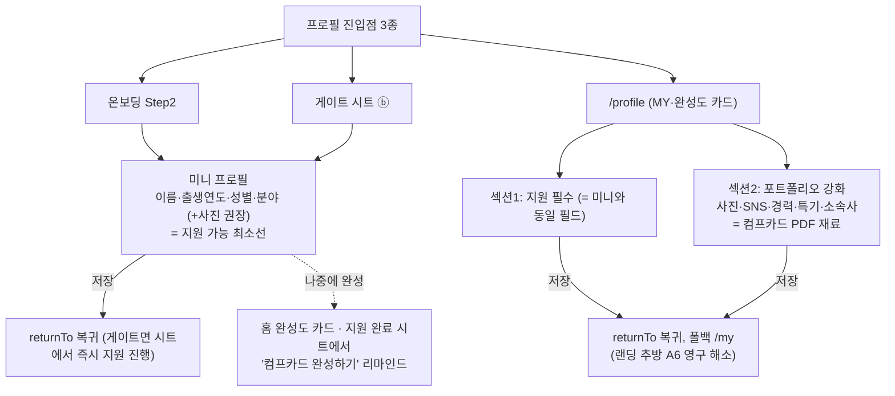

# IA + 유저 워크플로우 설계 (12)

> 작성일: 2026-07-15 · 상위 기준: `00_decision-brief.md`(D5·D6 준수) · 근거: `02_ux-audit.md`, `03_design-copy-seo-audit.md`
> 원칙 3줄: ① 여정은 절대 끊기지 않는다(returnTo 전면 도입) ② 지원은 1급 시민이다(전용 탭 + 무료 개방) ③ 비로그인 표면은 SEO 자산, 앱 표면은 리텐션 자산 — 둘을 명확히 분리한다.

---

## 1. 사이트맵 v2

### 1.1 전체 라우트 트리



- **5탭**: 홈 `/home` · 탐색 `/auditions` · 지원 `/applications` · 커뮤니티 `/community` · MY `/my`
- **비로그인 표면**은 전부 서버 렌더(SSR/ISR) + 메타 + 스키마. 앱 셸(BottomNav)은 비로그인에서도 홈·탐색·커뮤니티 탭 노출(지원·MY는 로그인 게이트 → §5).
- `/audition/[id]`는 **단수형 그대로 유지**: 색인된 상세 ~500건의 URL을 건드리지 않는 것이 명명 일관성보다 우선(D7 취지 — 프로덕션 SEO 이슈 우선). 카테고리 랜딩은 복수형 `/auditions/[category]` 하위로 배치해 충돌 없음(카테고리 슬러그 14개 화이트리스트, 그 외 404).

### 1.2 SEO 랜딩 14개 (탐색 탭 하위)

`/auditions/[category]` — 카테고리별 정적 경로 + ISR. 각각 고유 title/description/H1 + `ItemList` 스키마 + 카테고리별 대표 공고 SSR 리스트.

| 슬러그 | 카테고리 | 슬러그 | 카테고리 |
|---|---|---|---|
| `actor` | 배우(영화·드라마) | `musical` | 뮤지컬 |
| `theater` | 연극 | `model` | 모델 |
| `singer` | 가수·보컬 | `idol` | 아이돌 연습생 |
| `dance` | 댄서·안무 | `kids` | 아역·키즈 |
| `extra` | 보조출연·단역 | `mc` | MC·아나운서 |
| `voice` | 성우·더빙 | `creator` | 크리에이터·방송 |
| `ad` | 광고·CF | `agency` | 기획사 공개 오디션 |

> 슬러그·명칭은 백엔드 14개 카테고리 확정값에 맞춰 구현 시 1:1 매핑(여기 표는 IA상 자리 확보).

### 1.3 기존 → 신규 라우트 매핑 (리다이렉트 계획)

| 기존 라우트 | 신규 라우트 | 조치 | SEO 영향 |
|---|---|---|---|
| `/` (항상 랜딩) | 비로그인=랜딩 / 로그인=`/home` 리다이렉트 | 서버에서 세션 분기 | 없음(비로그인 크롤러는 랜딩 그대로) |
| `/auditions` | `/auditions` (유지, SSR 전환) | 변경 없음 | 메타·canonical 신설로 개선 |
| `/audition/[id]` | `/audition/[id]` (유지, 본문 SSR 전환) | **변경 없음** | 색인 500건 무손실 |
| — (신설) | `/auditions/[category]` ×14 | 신규 | 신규 랜딩 유입 |
| `/history` | `/applications` | **301** | 🔒 페이지라 색인 無, 북마크 보호용 |
| `/profile` | `/profile` (유지) | 변경 없음 | — |
| — (신설) | `/home`, `/onboarding`, `/board/[token]` | 신규 | `/home`·`/onboarding`은 robots 차단, `/board`는 noindex 메타 |
| `/pricing` | 제거 | **301 → `/`** | 라이브 sitemap에 실려 있으므로 410이 아닌 301 + sitemap 제거 |
| `/my/notifications` (준비중 스텁) | 제거(알림 실기능 전까지) | **301 → `/my`** | 🔒, 영향 없음 |
| `/community/*` | 유지 (상세 SSR + 메타 신설) | 변경 없음 | 롱테일 색인 신규 개방 |
| `/login`, `/signup` | 유지 + `?returnTo=` 지원 | 변경 없음 | robots 차단 유지 |

리다이렉트는 `next.config.js` `redirects()`(영구)로 선언 — 미들웨어 분기(`/` 세션 분기)와 분리 관리.

---

## 2. 내비게이션 모델

### 2.1 바텀 탭 5개

| # | 라벨 | 아이콘(lucide) | href | 활성 규칙 (prefix 매칭) | 비로그인 동작 |
|---|---|---|---|---|---|
| 1 | 홈 | `House` | `/home` | `/home` 시작 | 탭 숨김 대신 **`/`(랜딩)로 연결**, 활성 규칙 `/` 완전일치 |
| 2 | 탐색 | `Search` | `/auditions` | `/auditions` 또는 `/audition/` 시작 | 그대로 접근 가능 |
| 3 | 지원 | `Send` | `/applications` | `/applications` 시작 | 탭은 노출, 터치 시 **로그인 바텀시트**(§2.3) — 예상 밖 페이지 이동 금지 |
| 4 | 커뮤니티 | `MessagesSquare` | `/community` | `/community` 시작 | 그대로 접근 가능(읽기) |
| 5 | MY | `CircleUser` | `/my` | `/my` 또는 `/profile` 시작 | 탭 노출, 터치 시 로그인 바텀시트 |

- 활성 판정: `pathname === href || pathname.startsWith(prefix)` — 상세·2뎁스 화면에서도 소속 섹션이 항상 점등(현행 완전일치 버그 해소).
- 아이콘 `strokeWidth: 1.75` 통일, 활성 시 인디고 + 라벨 medium. 그라데이션·글로우 금지(D6).
- 탭 재터치(이미 활성) = 해당 섹션 루트로 스크롤 톱 + 상태 리셋(iOS 관례).
- 온보딩·글쓰기·지원자 보드·인증 화면에서는 BottomNav 숨김(풀스크린 태스크).

### 2.2 헤더 규칙

패턴 3종만 사용. 화면별 자체 뒤로가기 구현 금지(현행 3벌 난립 해소).

| 패턴 | 구성 | 적용 화면 |
|---|---|---|
| **루트형** | 좌: 로고(로그인=`/home`, 비로그인=`/`) · 우: 알림 아이콘(추후)+검색(탐색만) | 홈, 탐색, 지원, 커뮤니티, MY (탭 루트 5개) |
| **상세형** | 좌: 뒤로가기(`router.back()`, 히스토리 없으면 소속 탭 루트로 폴백) · 중: 타이틀 · 우: 컨텍스트 액션(공유·찜·⋯메뉴) | 오디션 상세, 커뮤니티 상세, 프로필, 지원 상세 |
| **태스크형** | 좌: 닫기(X, 이탈 confirm) · 중: 타이틀 · 우: 완료/등록 버튼 | 글쓰기, 글수정, 온보딩 |

- 로그아웃은 헤더에서 제거 → MY 하단에만(현행 최다 사용 위치에 최소 사용 액션 배치 문제 해소).
- 타이틀: 탭 루트는 로고 또는 섹션명, 상세형은 축약 타이틀(스크롤 시 페이드 인).

### 2.3 바텀시트 vs 모달 vs 페이지 — 사용 기준

| 수단 | 기준 | 적용 사례 |
|---|---|---|
| **바텀시트** | "현재 맥락을 유지한 채 짧은 입력/선택" — 이탈 없이 완료 가능해야 함 | ① 지원 게이트(로그인/미니프로필 보완) ② 탐색 필터(지역·페이·지원방식) ③ 비로그인이 지원·MY 탭/좋아요·댓글 터치 시 로그인 유도 ④ 공유 시트 |
| **모달(중앙)** | 파괴적 행동의 확인만 | 글 삭제, 지원 취소, 로그아웃 confirm (native `confirm()` 전폐) |
| **페이지 이동** | 3필드 초과 입력·독립 태스크 | 프로필 전체 편집, 글쓰기, 온보딩 |

- 바텀시트 공통: 스프링 모션 + 딤 배경, 드래그/딤 터치로 닫기, `prefers-reduced-motion` 시 페이드 대체(D6).
- **게이트 원칙**: "에러 토스트 + 강제 리다이렉트"는 시스템 전체에서 금지. 게이트는 반드시 그 자리 위의 시트로 뜬다.

### 2.4 하단 고정 레이어 & safe-area

```
z-순서 (아래→위): BottomNav → 컨텍스트 바 1개(지원 바 또는 댓글 바) → 바텀시트 → 모달 → 토스트
```

- BottomNav 위 컨텍스트 바는 **동시 1개만** 허용(현행 겹겹 적층 금지).
- BottomNav: `padding-bottom: env(safe-area-inset-bottom)` / 컨텍스트 바·바텀시트도 동일 적용. `viewport-fit=cover` 선언, `maximumScale:1` 제거(접근성).
- 바텀시트가 열리면 컨텍스트 바는 시트 뒤로 숨김(중복 CTA 방지).

---

## 3. 화면 인벤토리

| 화면 | 라우트 | 목적 | 핵심 요소 | 주 진입점 | 설계된 이탈점(다음 행동) |
|---|---|---|---|---|---|
| 마케팅 랜딩 | `/` | 비로그인 가치 전달 → 저마찰 유입 | 에디토리얼 히어로, 실시간 공고 카운터, "오늘 올라온 오디션 보기" CTA | 검색·광고·직접 유입 | `/auditions`(주) · `/signup`(부) |
| 로그인 | `/login` | 재인증 | 구글 OAuth(주) + 이메일(보조), returnTo 유지 | 게이트 시트의 "로그인" | returnTo 복귀 (폴백 `/home`) |
| 가입 | `/signup` | 계정 생성 | 구글 OAuth 우선 배치, 이메일 가입은 하단 | 랜딩·게이트 시트 | `/onboarding?returnTo=…` |
| **온보딩 Step1** 🆕 | `/onboarding` (step=1) | 분야 선택 | 14 카테고리 중 다중 선택 1질문(현행 "활동분야+장르" 이중 질문 통합), 스킵 | 가입 직후 자동 | Step2 |
| **온보딩 Step2** 🆕 | (step=2) | 미니 프로필 | 이름·출생연도·성별 3필드만, 스킵 | Step1 | Step3 |
| **온보딩 Step3** 🆕 | (step=3) | 첫 추천 | 선택 분야 기반 공고 3~5건 + "바로 지원 가능" 표시 | Step2 | 공고 탭→상세 / "홈으로" / returnTo 있으면 원래 맥락 복귀 |
| 앱 홈 | `/home` | 로그인 착지·개인화 허브 | ① **원클릭 오디션(바로 지원 가능 공고, 초록 pill) — 핵심 기능, 항상 메인 최상단 고정 노출** ② 프로필 완성도 카드 ③ 마감 임박 ④ 내 분야 신규 ⑤ 지원 현황 요약 | `/` 리다이렉트, 로고, 홈 탭 | 상세·지원 탭·프로필 |
| 탐색 리스트 | `/auditions` | 전체 공고 탐색 | 검색, 카테고리 칩(1축) + 필터 바텀시트(2축: 지원방식·지역·페이), 무한스크롤+스크롤 보존, 스켈레톤 | 탭·랜딩 CTA·SEO 랜딩 | 상세, 카테고리 랜딩 |
| SEO 랜딩 ×14 🆕 | `/auditions/[category]` | 검색 유입 착지 | 카테고리 H1+설명, SSR 리스트, 타 카테고리 링크(내부 링크 그물) | 구글 검색 | 상세, 탐색 |
| 오디션 상세 | `/audition/[id]` | 공고 이해→지원 결정 | D-day·검증 배지·출처 링크, 본문 SSR, 하단 지원 바, **마감 시 "비슷한 오디션" 3건**(데드엔드 제거) | 리스트·홈·SEO·공유 | 지원(시트)·찜·공유·비슷한 공고 |
| **지원 게이트 바텀시트** 🆕 | (상세 위 오버레이) | 이탈 0 게이트 | 상태별 3변형: ⓐ비로그인→소셜 로그인 ⓑ프로필 부족→부족 필드만 인라인 입력 ⓒ완비→지원 확인+컴프카드 미리보기(R2부터 — R1은 프로필 요약 표시, 11 F5) | 지원 바 터치 | 그 자리에서 지원 완료 |
| **지원 탭** 🆕 | `/applications` | 지원 추적(1급 승격) | 세그먼트: 지원함(발송→열람→회신 상태칩) / 찜 · 각 건에 "지원자 보드 보기" | 탭·지원 완료 토스트 | 상세 재방문·다음 추천 |
| 커뮤니티 리스트 | `/community` | 정보·동료 교류 | 카테고리 칩(URL 반영 통일), 글 목록 | 탭 | 상세·글쓰기 |
| 커뮤니티 상세 | `/community/[id]` | 글 소비·반응 | 본문(SSR+Article 스키마), 좋아요·댓글, 본인 글 ⋯메뉴에 **수정+삭제** | 리스트·검색·공유 | 댓글 작성·목록 복귀 |
| 글쓰기/수정 | `/community/write`, `[id]/edit` | 작성 | 태스크형 헤더, 이탈 confirm+임시저장(localStorage) | 리스트 FAB | 등록→상세 |
| MY 허브 | `/my` | 계정·설정 | 프로필 카드(완성도), 내가 쓴 글, 공지·FAQ·약관, 로그아웃 | 탭 | 프로필·문서 |
| 프로필 | `/profile` | 프로필 관리 | **2섹션**: 지원 필수(이름·출생연도·성별·분야, 사진 권장) / 포트폴리오(사진·SNS·경력·특기·소속사), 필수만으로 저장 가능 | MY·홈 완성도 카드·게이트 시트 "전체 작성" | **returnTo 복귀** (폴백 `/my`) |
| **지원자 보드** 🆕 | `/board/[token]` | CD가 지원자 열람(D3) | 읽기 전용: 지원자 리스트+컴프카드 뷰어, "CD 계정 만들기" CTA, noindex·토큰 인증 | 지원 메일 내 링크 | CD 가입(추후 범위) |
| 공지·FAQ·약관 | `/my/*` | 문서 | 정적 | MY | 뒤로가기 |

---

## 4. 핵심 유저 플로우

### F1. 신규 방문 → 가입 → 온보딩 → 첫 지원 (15단계 → **7단계**)



| | 현재 (15단계) | 신규 (7단계) |
|---|---|---|
| 인증 | 이메일 더블 옵트인(메일함 이탈 2단계) | 구글 OAuth 1탭 |
| 프로필 | 지원 클릭 후 에러→15필드 롱폼→랜딩 추방→재검색 (6단계 낭비) | 온보딩 3필드 선입력, 게이트는 시트 |
| 여정 리셋 | 2회 (인증 착지, 프로필 저장) | **0회** |

### F2. 재방문 → 탐색 → 지원 (returnTo 동작 포함)



단계: 4~5단계(홈→탐색→상세→시트→완료). 세션 만료 시에도 returnTo로 +1단계만 추가.

### F3. 비로그인 SEO 유입 → 지원 시도 → 가입 → 원래 오디션 복귀



- `apply=1` 파라미터가 "지원 의도"를 세션 넘어 보존 — 복귀 즉시 시트 자동 오픈, 유저가 지원 버튼을 다시 찾지 않게 함.
- 현재는 이 플로우가 `상세→로그인→/auditions 강제착지→재검색`으로 끊김(C1·A6). 신규는 이탈 지점 0.

### F4. 지원 후 → 지원 탭 상태 확인 → 다음 오디션 추천



- "열람됨" 상태(메일 오픈 트래킹)와 지원자 보드 열람 수는 D2 과금 후보(지원 열람 확인) — IA상 자리만 확보, 무료 범위는 발송/회신.

### F5. 프로필 작성 (미니 vs 완성 분기)



- 미니 프로필 = 지원 언블록, 완성 프로필 = 전달물 품질(D1 컴프카드). 두 개념을 UI 전체에서 "지원 가능" / "컴프카드 준비됨" 2개 상태 배지로 노출.

---

## 5. 상태 × 화면 노출 규칙 매트릭스

| 화면 / 상태 | 비로그인 | 로그인 · 프로필 없음 | 미니 프로필 | 완성 프로필 |
|---|---|---|---|---|
| `/` | 마케팅 랜딩 | → `/home` 리다이렉트 | 동일 | 동일 |
| `/home` | → `/`(미들웨어) | 완성도 카드 **강조**(0%) + 온보딩 재개 CTA | 완성도 카드(컴프카드 유도) | 완성도 카드 숨김, 추천 중심 |
| 탐색 / SEO 랜딩 | 전체 공개 | 공개 + 내 분야 칩 프리셋 없음 | 내 분야 칩 프리셋 | 동일 |
| 상세 — 지원 바 | "지원하기" → 시트 ⓐ(로그인) | → 시트 ⓑ(미니 입력) | → 시트 ⓒ(확인·발송) | 시트 ⓒ + 컴프카드 첨부 미리보기 |
| 상세 — 찜 | 시트 ⓐ | 즉시 동작 | 동일 | 동일 |
| 지원 탭 | 탭 터치 → 시트 ⓐ | 엠티: "첫 지원을 시작해보세요"+추천 | 이력/찜 정상 | 동일 (열람 상태는 D2 과금 후보 — §4 F4 주석, 무료 범위는 발송/회신) |
| 커뮤니티 읽기 | 공개 | 공개 | 공개 | 공개 |
| 좋아요·댓글·글쓰기 | 시트 ⓐ (returnTo=현재 글) | 즉시 동작 | 동일 | 동일 |
| MY 탭 | 탭 터치 → 시트 ⓐ | 프로필 카드 "작성 시작" | "지원 가능 ✓ / 컴프카드 미완" | "컴프카드 준비됨 ✓" |
| `/onboarding` | → `/login` | 접근 가능(재개) | Step 건너뛰고 잔여만 | → `/home` |
| `/board/[token]` | 토큰 유효 시 공개(계정 무관) | 동일 | 동일 | 동일 |

공통 규칙: **비로그인에게 "숨기기"보다 "보여주되 행동 시점에 시트"** — SEO·가치 선노출을 위해 콘텐츠는 열고, 쓰기 행동만 게이트한다. 죽은 버튼(무반응) 전면 금지.

---

## 6. returnTo 명세

### 6.1 파라미터 규칙

- 키: `returnTo` · 값: **내부 경로만**(`/`로 시작, `//`·`http` 시작 거부 — 오픈 리다이렉트 방어), 쿼리 포함 가능, URL 인코딩.
- 검증 유틸 `resolveReturnTo(raw, fallback)` 단일 구현을 미들웨어·클라이언트 공용 사용.
- 체인 보존: 다단계 이동(가입→온보딩) 시 파라미터를 그대로 릴레이. 유실 대비로 시트 게이트 발동 시 `sessionStorage`에도 백업(브라우저 OAuth 왕복 대응).
- 의도 보존 확장: 지원 의도는 `returnTo` 경로에 `?apply=1`을 실어 복귀 후 시트 자동 오픈(F3).

### 6.2 적용 지점 전체 목록

| # | 발생 지점 | 세팅 주체 | 소비 시점 |
|---|---|---|---|
| 1 | 미들웨어 🔒 경로 차단 (`/home`·`/applications`·`/my`·`/profile`·`/onboarding`) | 서버: `/login?returnTo=원경로+쿼리` | 로그인 성공 |
| 2 | 게이트 시트 ⓐ의 "로그인/가입" | 클라: 현재 경로(+`apply=1`) | OAuth 콜백 → 온보딩 → 복귀 |
| 3 | 커뮤니티 좋아요·댓글·답글 (비로그인) | 클라: 현재 글 경로 | 로그인 성공 |
| 4 | 글쓰기 진입 (비로그인) | 클라: `/community/write` | 로그인 성공 |
| 5 | `/signup` → `/onboarding` | 릴레이 | 온보딩 완료·스킵 |
| 6 | 프로필 폼 저장 (`/profile?returnTo=`) | 진입시킨 화면 | 저장 성공 |
| 7 | 온보딩 완료/스킵 | 릴레이분 | `/home` 또는 returnTo |
| 8 | `auth/callback` (OAuth·이메일 공용) | 쿼리 통과 | 세션 수립 직후 |

### 6.3 폴백 규칙

```
returnTo 유효     → 해당 경로로 복귀
無 또는 검증 실패 → 로그인 유저: /home · 온보딩 미완 신규: /onboarding
로그아웃 후       → / (랜딩)
```

- 폴백으로 `/auditions`를 쓰지 않는다 — "홈"이 단 하나의 기본 착지점(현행 홈 2개 문제 해소).
- returnTo 대상이 🔒인데 권한 부족(예: 삭제된 글)이면 해당 섹션 탭 루트로 2차 폴백 + 안내 토스트.

---

## 7. 구현 우선순위 메모 (IA 관점)

1. **P0 — 여정 봉합**: returnTo 시스템(§6) + `/` 세션 분기 + 프로필 저장 복귀 + 필터 초기화 버그. 신규 화면 없이 기존 라우트만으로 가능.
2. **P1 — 골격 교체**: 5탭 BottomNav(prefix 활성·safe-area) + 헤더 3패턴 + `/home` + `/applications`(=history 301).
3. **P2 — 전환 엔진**: 지원 게이트 바텀시트 3변형 + 온보딩 3스텝 + 프로필 2섹션 재편.
4. **P3 — 유입 확장**: SEO 랜딩 14개 + 상세·커뮤니티 SSR + sitemap 복구(D7) + 지원자 보드 웹뷰(D3).

---

*다음 단계: 이 IA 기준으로 13_wireframes(화면별 와이어) 및 PRD 상세화. 라우트 매핑표(§1.3)는 구현 시 `next.config.js` redirects의 단일 출처로 사용.*
