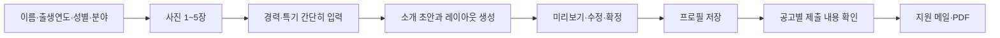

# 자동 프로필 완성 기획 — 2026-09-10

## 제품 결정

사용자가 사진과 사실 정보를 넣으면 **지원에 바로 쓸 수 있는 사진 중심 캐스팅 프로필**을 완성한다. AI 소개문 생성은 그 안의 한 단계다. 사진 배치, 정보의 우선순위, 빈 항목 정리, 경력 구성, 발송 결과물까지 하나의 흐름으로 만든다.

기본 스타일은 밝은 종이색 바탕·짙은 글자·작은 브랜드 포인트를 사용하는 캐스팅 프로필로 제안한다. 현재 서비스의 웜 톤과 이어지고, 사진과 이름이 먼저 보이게 한다. 사용자 스타일 선호는 아직 확정되지 않았으므로 디자인 제안으로 취급한다.

## 사용자 흐름

- 첫 방문에서는 최소 정보만으로 지원할 수 있다. 사진·소개·경력은 완성도를 높이는 항목이며 저장을 막지 않는다.
- 이미 프로필이 있으면 다시 질문하지 않는다. 사진 추가나 경력 수정만으로 구성이 갱신된다.
- AI가 만든 문장은 기존 소개와 나란히 보여준다. “이 소개 사용하기” 또는 “기존 소개 유지”로 결정한다.
- 저장 전 편집 내용, 저장된 프로필, 실제로 제출한 버전을 구분한다. 편집했다고 이전 지원 내용이 바뀌지 않는다.
- 자동 완성 후 첫 행동은 “이 프로필로 지원하기”다. 템플릿 꾸미기 자체가 끝없는 작업이 되지 않게 한다.

## 무엇을 자동으로 완성할 것인가

| 입력 | 자동 처리 | 사용자에게 남기는 결정 |
|---|---|---|
| 사진 1~5장 | 사진 수·가로세로 비율에 맞는 배열, 해상도·중복 체크 | 대표 사진, 순서, 얼굴이 잘리지 않는 위치 |
| 기본 정보 | 이름·분야·출생연도·신체 정보를 정해진 순서로 표시 | 정보 정정, 표시할 선택 항목 |
| 특기·경력 메모 | 사실 추출, 문장 다듬기, 경력 항목 분리 | 추출 결과 확인과 수정 |
| 한 줄 소개 | 최대 100자의 사실 기반 소개 초안 | 초안 사용 여부 |
| 부족한 정보 | 미입력 섹션 숨김, 도움이 되는 다음 항목 1~2개 제안 | 나중에 채우기 |
| 지원 공고 | 제출에 필요한 항목과 현재 프로필 비교 | 추가 자료 준비, 발송 확정 |

자동 처리의 경계:

- 출연작·학력·수상·소속·가능 기술을 지어내지 않는다. “경험 없음”을 경력처럼 포장하지 않는다.
- 생년만 있는 현재 데이터로 정확한 만 나이를 생성하지 않는다. 출생연도를 표시한다.
- 사진을 다른 사람처럼 바꾸거나 AI 얼굴·체형으로 대체하지 않는다. 기본 기능은 배치·크롭·해상도 안내다.
- 이름·나이·성별·신체 정보를 사진에서 추정해서 채우지 않는다.
- 연락처는 본인 관리 화면과 사용자가 확정한 제출물에만 포함한다. 공개 공유는 별도 동의·별도 링크로 설계한다.

## 기본 레이아웃

### 1. 캐스팅 프로필 — 기본

- 상단: 왼쪽 대표 사진 42%, 오른쪽 이름·분야·핵심 정보 58%.
- 이름: 가장 큰 글자, 분야는 바로 아래. 소개는 다음 문단에서 1~2문장으로 읽힌다.
- 중단: 특기와 활동 이력. 비어 있는 항목은 라벨까지 숨긴다.
- 하단: 추가 사진 2열, 연락·포트폴리오 링크.
- 사진이 없으면 편집 화면에서는 사진 추가 안내, 제출물에서는 빈 사진 프레임을 빼고 텍스트형으로 전환한다.
- 긴 이름·여러 분야·500자 경력에서도 잘리거나 겹치지 않아야 한다.

### 2. 사진 포트폴리오 — 후속 선택지

- 모델·촬영모델처럼 사진 비중이 높은 사용자를 위한 구성.
- 큰 사진 1장 + 보조 사진 2~4장. 사진 면적 약 65~70%.
- 신체 정보는 좁은 한 줄로 정리하고, 경력은 사진 뒤에 배치한다.

### 3. 활동 이력 중심 — 후속 선택지

- 배우·뮤지컬·성우처럼 작품·역할·특기가 중요한 사용자용.
- 상단 작은 대표 사진 + 이름, 본문은 작품·역할·연도 순의 경력 목록.
- 영상·음성 포트폴리오 링크를 경력 옆에 둔다.

처음부터 템플릿을 고르게 하지 않는다. 기본 구성을 먼저 만들고 미리보기에서 바꿀 수 있게 한다. “배우면 무조건 이 템플릿”처럼 직군을 고정하지 않는다.

## 화면 설계

1. **프로필 작성**: 최소 정보, 사진, 소개, 경력·링크. 선택 항목은 접을 수 있게 발전시킨다.
2. **자동 완성 결과**: 프로필 미리보기 + 생성된 소개 초안 + 빠진 자료 안내. 다시 생성해도 저장한 내용은 보존한다.
3. **사진 편집**: 대표 사진 지정, 순서 변경, 크롭 위치. 이미지 생성 대신 원본 보존이 기본이다.
4. **지원 확인**: 받는 곳·제출할 프로필 버전·사진 수·추가 요구사항을 보여준다. 실제 제출한 본문과 PDF를 여기서 확인한다.
5. **지원 기록**: 제출 시점의 프로필 버전·발송 요청 시각·처리 상태. 실제 확인하지 않은 접수·열람·회신을 표시하지 않는다.

## 결과물과 기술 구조

### 한 번 만든 데이터로 여러 결과물을 만든다

- `ProfileDocument`: 검증된 이름·분야·소개·경력·사진 메타데이터·템플릿·버전.
- 웹 미리보기, 이메일, PDF가 같은 `ProfileDocument`를 사용한다. 각각 별도의 문장 생성기를 만들지 않는다.
- AI는 제한된 JSON 구조를 반환한다. 데이터 검증 후 사용자 초안으로만 저장한다. 모델이 HTML/CSS를 직접 생성하게 하지 않는다.
- AI 장애 시 입력·저장·기본 레이아웃 생성은 계속 가능하다. 기존 소개를 유지하고 재시도할 수 있다.

### 단계적으로 추가할 데이터

- `profiles`: 대표 사진·표시 순서·템플릿 ID·완성 문서 버전.
- `profile_photos`: 원본 경로·픽셀 크기·크롭 좌표·표시 순서. 원본과 출력 파일을 구분한다.
- `profile_versions`: 저장 시점의 불변 데이터. 중간 타이핑마다 버전을 만들지 않는다.
- `applications`: 제출에 사용한 프로필 버전 참조.
- PDF는 서버에서 한글 폰트를 포함해 생성한다. 작업 실패 시 HTML 메일로 임의 전환하지 않고 제출 전 오류를 보여준다.
- 실제 발송은 저장된 요청·중복 방지 키로 처리한다. 재시도 중 프로필을 다시 렌더하면 요청 본문이 달라질 수 있으므로 불변 스냅샷을 사용한다.

### 사진 보관과 제출

- 프로필 편집에서 사진을 빼는 행동이 저장된 프로필을 즉시 깨뜨리면 안 된다.
- 제출 버전에서 참조하는 사진과 편집용 원본의 수명을 분리한다. PDF 첨부는 단기 서명 URL 만료로 사진이 사라지는 문제를 줄인다.
- 공개 URL 여부, 비공개 스토리지 전환, 회원 탈퇴 시 제출물과 서버 파일 처리 범위는 별도 데이터 정책으로 명문화한다.
- 현재 키즈모델 분야와 본인 가입 연령 제한은 같은 사용자 모델로 충분하지 않다. 보호자가 자녀 프로필을 관리하는 흐름은 별도 기획 대상으로 둔다.

## 이번 구현과 다음 구현의 경계

| 기능 | 이번 작업 |
|---|---|
| 숫자·빈 값 처리, 14개 분야 통일 | 구현 |
| AI 소개 초안 확인 후 적용 | 구현 |
| 사진 중심 실시간 구성 미리보기 | 구현 |
| 대표 사진 선택 | 구현 |
| 이메일 사진 2열 정리 | 구현 |
| 원문 경력의 구조화·사실 검증 UI | 다음 단계 |
| 템플릿 3종과 선택값 저장 | 후속 구현 완료 — 44 문서 참고 |
| 사진 크롭·해상도 안내·사진 수별 자동 배치 | 후속 구현 완료 — 45 문서 참고 |
| 프로필 버전·지원 기록 연결 | 후속 구현 완료 — 44 문서 참고 |
| PDF 생성·첨부 | 후속 구현 완료 — 45 문서 참고 |
| 공고별 필수 제출 항목 점검 | 다음 단계 |

편집 미리보기와 실제 PDF는 구분한다. 후속 구현에서 `제출 PDF 미리보기`로 실제 첨부 파일을 확인할 수 있게 했다(45 문서).

## 구현 순서와 완료 기준

1. **입력·미리보기 기반**: 성우 등 14개 분야가 모두 선택되고 최소 정보만 저장된다. 키·몸무게를 비워도 오류가 없고 AI 초안이 기존 소개를 덮어쓰지 않는다.
2. **프로필 문서·버전**: 편집 중 상태와 저장본이 구분되고, 이전 지원 시점의 제출물이 바뀌지 않는다.
3. **사진·템플릿**: 사진 0/1/3/5장, 긴 이름, 경력 없음/많음, 모바일 320px 및 데스크톱에서 겹침 없이 표시된다.
4. **PDF·메일 연결**: 한글 깨짐 없음, 페이지 밖 잘림 없음, 읽을 수 있는 링크, 발송 전 정확한 결과물 확인. 실패 시 새 지원이 발송되지 않는다.
5. **공고 맞춤 준비**: 필수 사진·영상·제목 형식이 부족하면 구체적으로 알려주고 사용자가 최종 결정한다.

측정: 최소 정보 저장 완료율, 초안 채택률, 첫 프로필 완성까지 시간, 사진 추가율, 프로필 완성 후 첫 지원 전환율, 발송 결과 복구 성공률. 목표 수치는 실제 기준선 수집 후 정한다.
